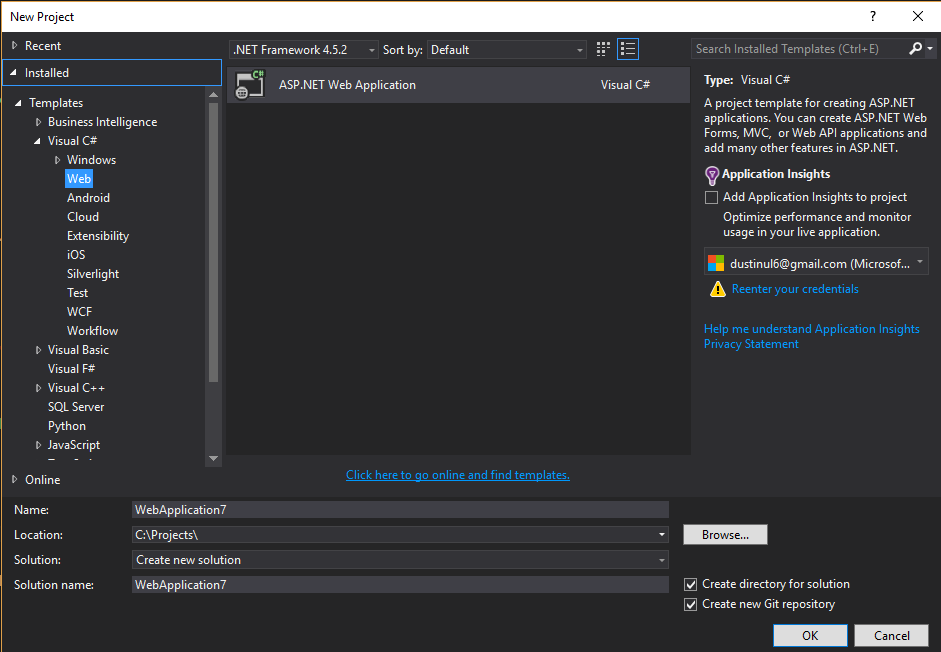
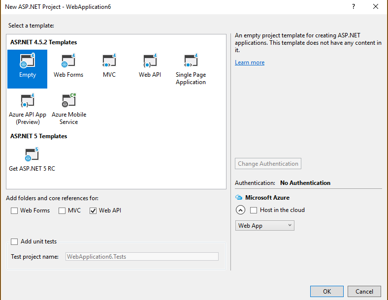

# 後端簡介

## 建立簡單的Api (無資料庫)
目標:能夠接收 Http Get Request, 並回傳JSON
此階段先不從SQL撈資料，資料直接寫在.NET code 中

### 新增專案



選擇新增ASP.NET Web Application



選擇Empty Template, 但在加入WebApi Folders and references的地方打勾

### ​定義Model
在.NET 中，所有資料都要對應到一個Type, 例如string, decimal, string[] 等等。
我們可以定義自己的Type: Class。一個class可以有很多fields, 每一個field 都可以是別的Type
在.NET中，每個class都有獨立的檔案，檔案名稱盡量跟class名稱相同，方便管理、避免混淆。
在 Solution Manager 中 Model 點右鍵，新增Class。命名為"Product"，並貼上以下Code

```csharp
namespace Demo02.Models
{
    public class Product
    {
        public string Name { get; set; }
        public int Id { get; set; }
        public decimal Price { get; set; }
    }
}
```
這個動作相當於定義了所有物件的結構，以後每創建一個Product物件，都會有上面三個屬性。
未來當我們需要創立一個新的物件(instance)，並assign給一個local variable 時，可用以下語法:


```csharp
var product = new Product(){
    Id = 1,
    Name = "Computer",
    Price = 100
}
```

### Controller and Routing
#### Routing 
參考: http://www.asp.net/web-api/overview/web-api-routing-and-actions/routing-in-aspnet-web-api

HttpRequest 基本格式 
~~~
GET [路徑(Uri)] HTTP/1.1
Host: http://www.wdmis.com/
~~~

我們希望透過指定不同的路徑，可以跟伺服器要到不同的資料
~~~
GET api/Products => 回傳所有Products
GET api/Products/2 => 回傳 Id是2的Product
POST api/Products => 新增一個Product
~~~

1. Controller 的功能就在於接收Http Request 並撈取、運算要回傳資料。
2. 一個controller 是由好幾個Action 所構成，每個Action 處理一種Request Method + Uri組合。  ​
3. Routing 就是在決定一個Request Method + Uri，要對應到哪一個Controller以及哪一個Action。
4. 路徑可以使用預設規則，或是自訂規則。
舉例:

打開 AppStart/WebApiConfig.cs 看看routing的設定
```csharp
public static class WebApiConfig
{
    public static void Register(HttpConfiguration config)
    {
        // Web API configuration and services

        // Web API routes
        config.MapHttpAttributeRoutes();

        config.Routes.MapHttpRoute(
            name: "DefaultApi",
            routeTemplate: "api/{controller}/{id}",
            defaults: new { id = RouteParameter.Optional }
        );
    }
}
```

在Controller資料夾新增Controller, 選擇Empty Controller, 命名為 "ProductsController"
```csharp
public class ProductsController : ApiController
{
    public IHttpActionResult GetAllProducts() { }
    public IHttpActionResult GetProductById(int id) { }
    public HttpResponseMessage DeleteProduct(int id){ }
}
```
以上有三個Actions, 每個Action都是一個function (method)
依照預設路徑，路徑包含 api/Products都會導引到 ProducstController
GetAllProducts 要對應到 Get api/Products
GetProductById 會對應到 Get api/Products/2
DeleteProduct 會對應到 Post api/Products/2

#### Actions in Controller

1. GetAllProducts
編輯第一個Action，新增兩個Product 實體，存到一個list中，回傳整個list。WebApi會自動幫我們把資料用JSON 格式回傳出去。
```csharp
public IHttpActionResult GetAllProducts()
{
    var product1 = new Product()
    {
        Id = 1,
        Name = "Desktop Computer",
        Price = 100
    };
    var product2 = new Product()
    {
        Id = 1,
        Name = "Laptop Computer",
        Price = 150
    };

    var products = new List<Product>()
    {
        product1,
        product2
    };
    return Ok(products);
}
```
2. GetProductById
```csharp
public IHttpActionResult GetProductById(int id)
{
    if (id == 1)
    {
        return Ok(new Product()
        {
            Id = 1,
            Name = "Desk",
            Price = 0
        });
    }
    return NotFound();
}
``` 
#### Build 
1. F5 : 啟動Debug Mode, 可設定 break points, 但debug狀態下不能編輯。在游標所在的位置按下F9可設定斷點。
2. Ctrl + F5 : 啟動伺服器，伺服器啟動的狀態下，可編輯，並且可用 Crtl + B重新 Build並馬上測試結果。但無法設break points

#### Test with Postman

## 與資料庫連結 Entity Framework

### Model 與 SQL database 的對應
1. 一個Class對應到一個SQL Table
2. 一個實體(Instance) 對應到一筆資料(row)
3. 一個 property 對應到一個 SQL 欄位

用 DbContext 來建立對應關係，並且在Runtime中去query database

1. 新增資料庫:在SQL management studio 新增資料庫，命名 "Demo3"
2. 取得資料庫 connection string: 
    1. 在 Visual Studio中，Tools/Connect to Database 指定要連線的資料庫。
    2. 在左側的 Server Explorer 中，選取該資料庫，按右鍵選Properties, 即可檢視 connection string
3. 把connection string 存在 Web.config 中
```xml 
<configuration>
  <configSections>
    ...
  </configSections>
  //以下新增:
  <connectionStrings>
    <add name="ProductsContext" connectionString="Data Source=TzuYaoPC;Initial Catalog=Demo3;Persist Security Info=True;User ID=username;Password=xxxx"
      providerName="System.Data.SqlClient" />
  </connectionStrings>
  ...
```

4. 建立 ProductsDbContext, 繼承 DbContext


### CodeFirst Migration 
我只要維護 .NET code, EF 自動幫我產生Sql code, 調整 Database schema

### 
