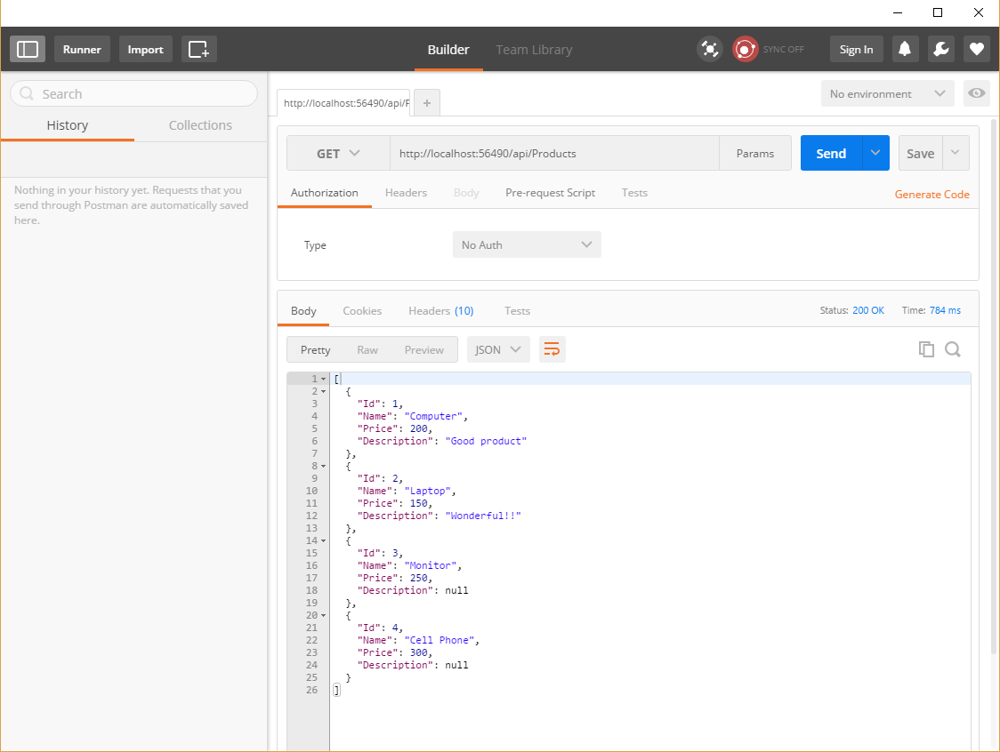

# 後端簡介

## 目標: 建立簡單的Api  
第一階段: 無資料庫連結，著重在理解 Model 與 Controller 怎麼運作。資料直接寫在 Controller裡面。
我們將作出一個能接收Http Request, 並回傳 Model資料的 Api 。

第二階段: 用Entity Framework 來管理 Model與資料庫的連結。
 
1. 用DbContext來註冊哪個Model要對應到資料庫的Table
2. 用CodeFirst Migration 來追蹤Model 的修訂，並且自動產生 SQL code來更新資料庫定義。

## 新增專案


選擇新增ASP.NET Web Application


選擇Empty Template, 但在加入WebApi Folders and references的地方打勾

## ​定義Model

在.NET 中，所有資料都要對應到一個Type, 例如string, decimal, string[] 等等。
我們可以定義自己的Type: Class。一個class可以有很多fields, 每一個field 都可以是別的Type。
在.NET中，每個class都有獨立的檔案，檔案名稱盡量跟class名稱相同，方便管理、避免混淆。
在 Solution Manager 中 Model 點右鍵，新增Class。命名為"Product"，並貼上以下Code

```csharp
namespace Demo02.Models
{
    public class Product
    {
        public string Name { get; set; }
        public int Id { get; set; }
        public decimal Price { get; set; }
    }
}
```

這個動作相當於定義了所有物件的結構，以後每創建一個Product物件，都會有上面三個屬性。
未來當我們需要創立一個新的物件(instance)，並assign給一個local variable 時，可用以下語法:


```csharp
var product = new Product(){
    Id = 1,
    Name = "Computer",
    Price = 100
}
```

## Controller 

一個 API 最基本的功能就是讓使用者能夠存取伺服器裡的資料。一個Controller 就是去做邏輯運算，去處理接收的資料或是要給出資料。一個 Controller 通常會對應到一個 Model, 針對這種資料執行四個種類的動作(CRUD Actions) :
    1. Create: 新增一筆資料
    2. Read: 讀取資料(包含讀取一筆，以及讀取全部，或是讀取符合某些條件的資料)
    3. Update: 更新資料
    4. Delete: 刪除資料

我們的目標就是要讓Controller 能夠接收指令，並完成指定的動作。不過，一個更根本的問題是，當我的API收到一個 HttpRequest, 要怎麼決定要用哪一個 Controller, 並且使用哪一個 Action?

.NET Web API 有一套Routing 的規則，我們只要依照這套規則來命名我們的 Controllers 和 Actions, .NET 就會幫我們自動挑選適當的 Controlle + Action 來回應一個 HttpRequest。

要理解這套規則，要先複習一下 HttpRequest 的格式:

### Routing 
參考: http://www.asp.net/web-api/overview/web-api-routing-and-actions/routing-in-aspnet-web-api

HttpRequest 基本格式 
~~~
GET api/Products HTTP/1.1
Host: http://www.wdmis.com/
~~~
GET 是 Http Request Method, 常用的 Http Request Method 還有 POST, PUT, DELETE。 GET 通常用來讀取資料，POST 和 PUT 用來編輯或新增資料，DELETE用來刪除資料。

api/Products 是路徑 (Route), 像是地址。所以說，一個地址 + 動作構成了一個對API的指令。

而這些指令的格式也是有約定慣例:
~~~
GET api/Products => 回傳所有Products
GET api/Products/2 => 回傳 Id是2的Product
POST api/Products => 新增一個Product
DELETE api/Products/1 => 把 Id 是 1 的Product 移除
Put api/Products/4 => 編輯 Id 是4的 Product
~~~

而 .NET api 辨認這些 Request 並且挑選適當的 Controller and Action?

打開 AppStart/WebApiConfig.cs 看看routing的設定
```csharp
public static class WebApiConfig
{
    public static void Register(HttpConfiguration config)
    {
        // Web API configuration and services

        // Web API routes
        config.MapHttpAttributeRoutes();

        config.Routes.MapHttpRoute(
            name: "DefaultApi",
            routeTemplate: "api/{controller}/{id}",
            defaults: new { id = RouteParameter.Optional }
        );
    }
}
```
這個設定的意思是，當有人送了一個 route 包含了 "api/Products" 的字串，.NET Web API就會挑選名子叫做 ProductsController 的Controller。

另外不同的 HTTP Request Method (GET, POST, PUT, DELETE) 要對應到不同的 Action。

GET api/Products 通常會對應到名子為 `Get()` 或 `GetProducts()` 或 `GetAllProducts()` 的 Action

GET api/Products/1 通常會對應到名子是 `GetId()`, `GetProductById()` 等名子的 Action 

POST api/Products 通常會對應到名子是 `Create()` 的 Action
DELETE api/Products/2 通常會對應到名子是 `DELETE()`的 Action

我們今天先做一個能讀取資料的 Controller 就好(也就是接收 GET api/Products 的HttpRequest)

所以我們要建立一個Controller, 並新增一個名子是 `GetProductById()` 

在Controller資料夾按右鍵，選擇新增Controller, 選擇Empty Controller, 命名為 "ProductsController"，並貼上以下Code

```csharp
public class ProductsController : ApiController
{
    // GET api/Products
    public IHttpActionResult GetAllProducts()
    {
        var product1 = new Product()
        {
            Id = 1,
            Name = "Desktop Computer",
            Price = 100
        };
        var product2 = new Product()
        {
            Id = 1,
            Name = "Laptop Computer",
            Price = 150
        };
        var products = new List<Product>()
        {
            product1,
            product2
        };
        return Ok(products);
    }

    // GET api/Products/1
    public IHttpActionResult GetProductById(int id)
    {
        if (id == 1)
        {
            return Ok(new Product()
            {
                Id = 1,
                Name = "Desk",
                Price = 0
            });
        }
        return NotFound();
    }

}
```

我們新增了兩個 Actions, 依照 .NET Web API內建的命名規則，一個會接收 GET api/Products, 另一個會接收 GET api/Products/id 的 Request, 分別回傳多筆以及單筆資料。

### Build 

1. F5 : 啟動Debug Mode, 可設定 break points, 但debug狀態下不能編輯。在游標所在的位置按下F9可設定斷點。
2. Ctrl + F5 : 啟動伺服器，伺服器啟動的狀態下，可編輯，並且可用 Crtl + B重新 Build並馬上測試結果。但無法設break points

不管用哪個方法，Visual Studio 都會幫我們打開瀏覽器，並指向伺服器的位址。基本上都會在 localhost, 不過每個App使用的 port會不一樣。網址通常長這樣: "http://localhost:56490/"
把該網址複製下來。

## 用 Postman 測試 Api 

進入 Postman, 在URI列貼上剛剛複製下來的網址，接上 api/Products
確認我們的 HttpRequest Method 選擇了 GET ，按下 Send, 


應該就能看到資料了，資料應該是JSON 格式
~~~
[
  {
    "Id": 1,
    "Name": "Computer",
    "Price": 200,
    "Description": "Good product"
  },
  {
    "Id": 2,
    "Name": "Laptop",
    "Price": 150,
    "Description": "Wonderful!!"
  }
]
~~~
(截圖是後來才截的，所以多了兩筆資料，請忽略)

小結: 

1. 定義 Model 是在定義資料格式。
2. 一個 Model 通常會對應到一個 Controller, 這個Controller 通常會去執行四個種類的動作(CRUD) 
    1. Create: 新增一筆資料
    2. Read: 讀取資料(包含讀取一筆，以及讀取全部，或是讀取符合某些條件的資料)
    3. Update: 更新資料
    4. Delete: 刪除資料
4. 每個動作會對應到一個 HttpRequest Method + route, .NET web API routing 就是在決定給定一個傳送進來的 HttpRequest Method + route, 我要選擇哪一個 Controller 裡面的哪一個 Action 來執行動作。

5. 這篇講義示範了如何做出一個Controller, 並能接受 GET api/Products 的Request, 並回傳儲存在程式中的兩筆資料。

6. 下篇會著重在，如何把Model 的資料格式對應到 SQL Database中，並且維護這樣的對應關係，以及在 Controller 中能夠從Database讀取資料。

[下一篇: Entity Framework](EntityFramework.md)


